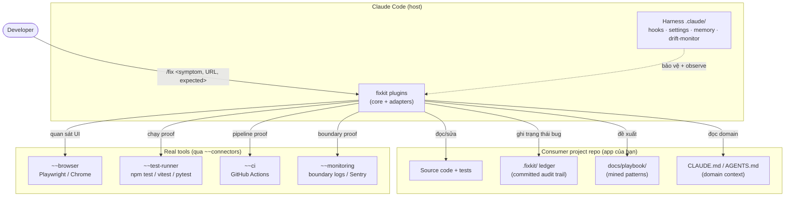
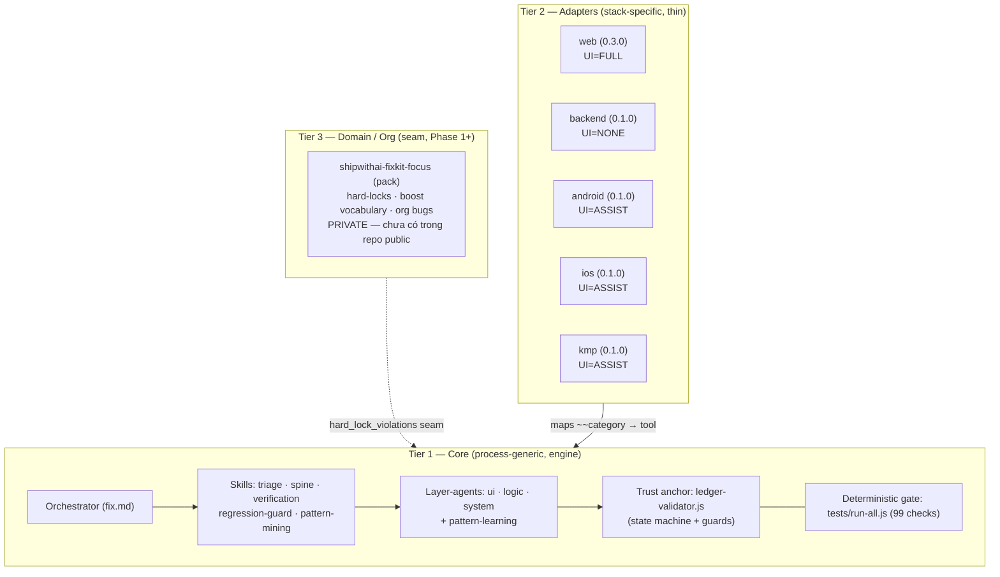
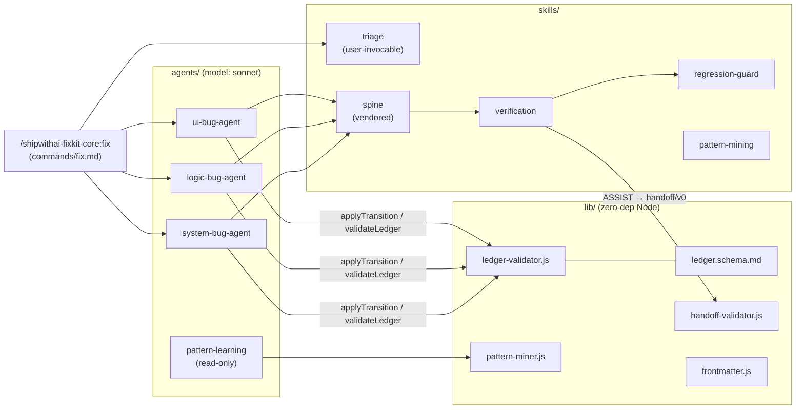
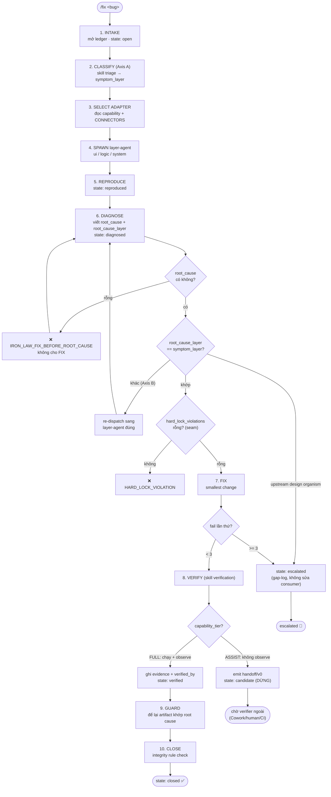
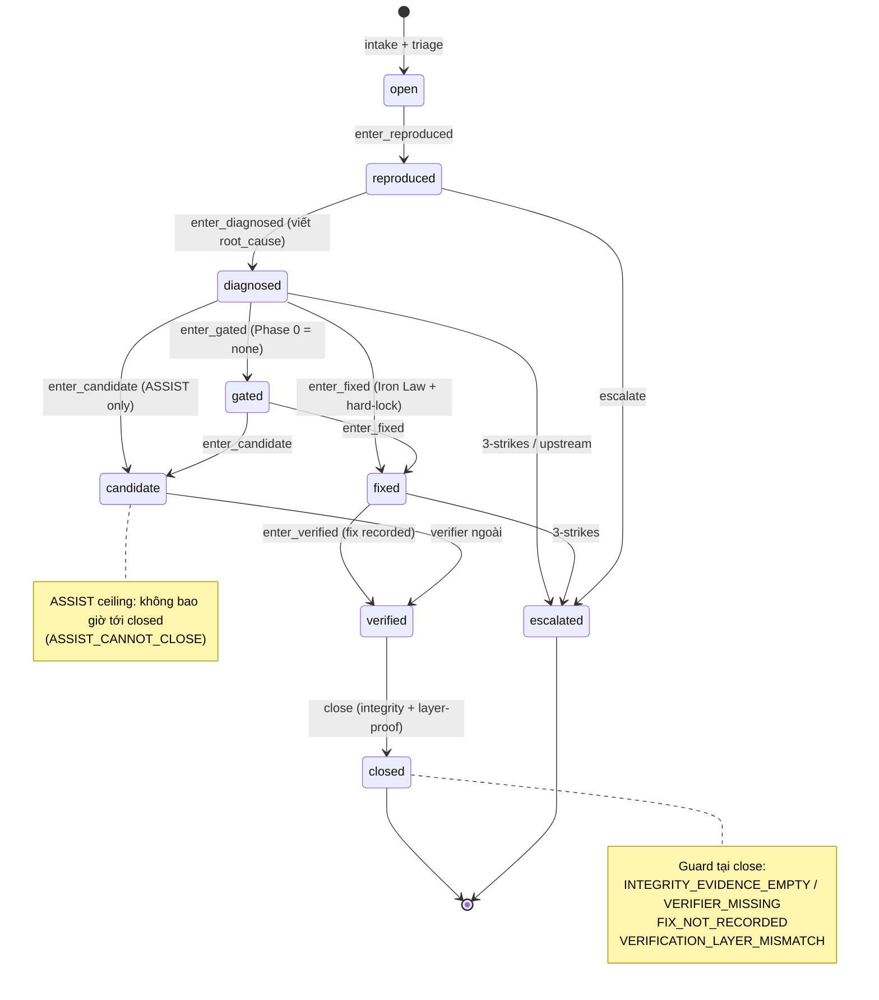
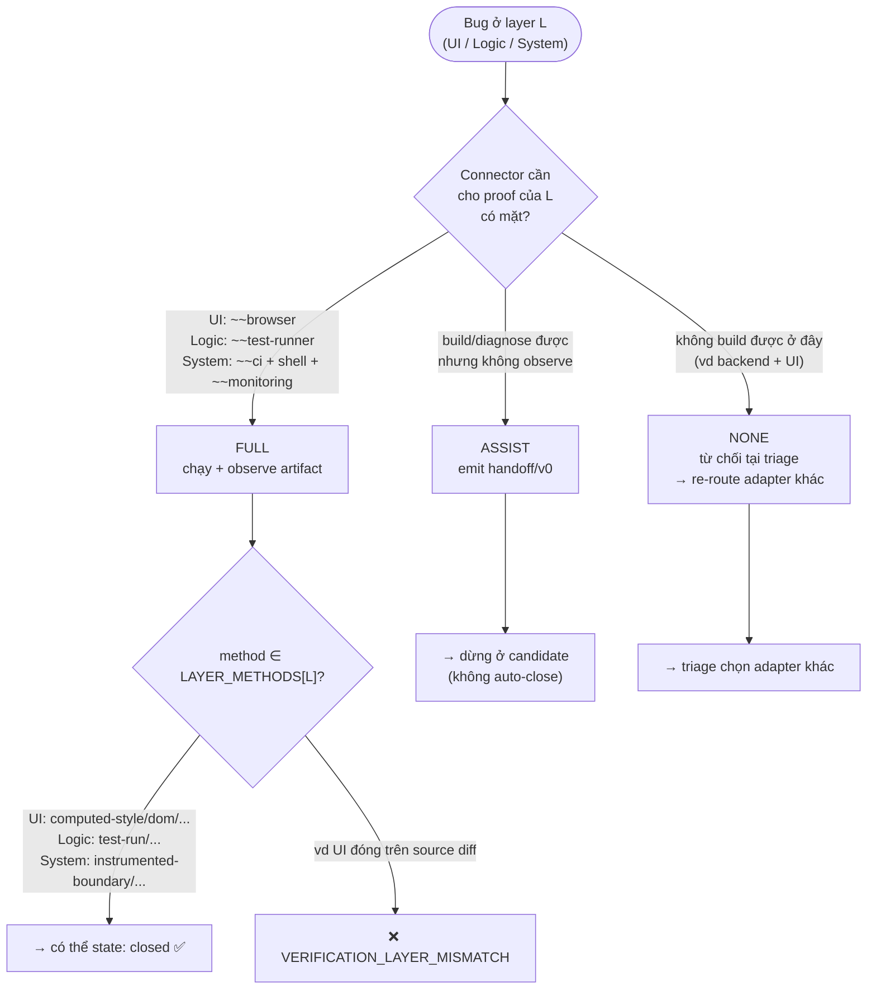
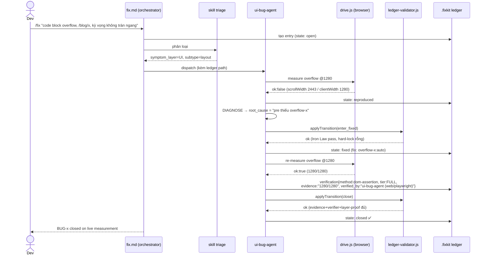
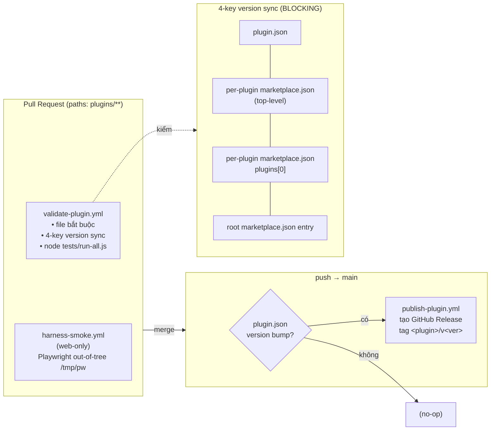

# shipwithai-fixkit — Design Diagrams (HLD + Solution Design)

> Biểu đồ Mermaid mô tả hệ thống **hiện có**. Quy ước màu/ghi chú:
> phần **Phase 0 (đã ship)** là nét liền; phần **Phase 1+ (mới là seam, chưa build)**
> được đánh dấu `(seam)` / nét đứt. Nguồn: nghiên cứu repo 2026-07.

---

## 1. HLD — System Context (ai tương tác với cái gì)

---

## 2. HLD — Kiến trúc phân tầng (3 tiers + cross-cutting)

**Nguyên tắc:** compose **by convention** (slash-path + sub-skill `user-invocable:false`
+ `agents/*.md`), **không** wiring qua `plugin.json` dependency. Adapter *phụ thuộc* core
(gọi xuống), không *chứa* core.

---

## 3. HLD — Bên trong Core (composition)

---

## 4. Solution — Vòng lặp Fix (10 bước + guards)

---

## 5. Solution — Ledger State Machine (trust anchor)

---

## 6. Solution — Quyết định Capability Tier (proof theo lớp)

---

## 7. Solution — Sequence: một bug UI trên web (concrete, FULL)

---

## 8. Solution — CI/CD & Versioning (infra hiện có)

---

## 9. Component tổng hợp — fixkit vs external (color-coded)

> Một đồ thị duy nhất gom **tất cả** components (commands · skills · agents · lib · adapters ·
> harness · CI · gate) và các hệ thống bên ngoài. Quy ước màu:
> **đen** = thành phần của fixkit · **vàng** = thành phần của hệ thống bên ngoài.

```mermaid
flowchart TB
    %% ===================== EXTERNAL (vàng) =====================
    dev(["👤 Developer"])

    subgraph host["Claude Code host + runtimes (external)"]
        cc["Claude Code<br/>(plugin host / agent runtime)"]
        node["Node.js<br/>(chạy validator + gate)"]
        py["Python 3 stdlib<br/>(chạy safety hooks)"]
    end

    subgraph realtools["Real tools — qua ~~connectors (external)"]
        pw["Playwright / Chromium"]
        runner["vitest / npm test / pytest"]
        gha["GitHub Actions"]
        sentry["Sentry / boundary logs"]
        git["git"]
    end

    subgraph gh["GitHub (external)"]
        mcp["MCP server: github<br/>api.githubcopilot.com"]
        rel["Releases + Package Registry"]
    end

    subgraph consumer["Consumer project repo (external)"]
        src["source code + tests"]
        fixdir[".fixkit/ ledger<br/>(audit trail)"]
        projctx["CLAUDE.md / AGENTS.md"]
        dspkg["node_modules/@mangalahq/<br/>shipwithai-sot-design<br/>(DS package · bug #16)"]
    end

    upstream["superpowers:systematic-debugging<br/>(MIT © Jesse Vincent — nguồn spine vendored)"]

    %% ===================== FIXKIT (đen) =====================
    subgraph root["fixkit repo root"]
        mkt["marketplace.json (root)<br/>+ per-plugin manifests"]
        gate["tests/run-all.js<br/>DETERMINISTIC GATE (99 checks)"]
    end

    subgraph harness["Harness .claude/ (fixkit)"]
        hcmd["hooks: validate-command.py<br/>protect-files.py · observe.py"]
        drift["drift-monitor agent"]
        settings["settings.json / memory"]
    end

    subgraph ci["CI .github/workflows (fixkit)"]
        wval["validate-plugin.yml<br/>(4-key version sync)"]
        wpub["publish-plugin.yml"]
        wsmoke["harness-smoke.yml"]
    end

    subgraph core["Plugin: shipwithai-fixkit-core — ENGINE (fixkit)"]
        cmd["commands/fix.md<br/>ORCHESTRATOR (main thread)"]

        subgraph sk["skills/"]
            triage["triage (user-invocable)"]
            spine["spine (vendored)"]
            verif["verification"]
            rguard["regression-guard"]
            mine["pattern-mining"]
        end

        subgraph ag["agents/ (model: sonnet)"]
            uia["ui-bug-agent"]
            la["logic-bug-agent"]
            sa["system-bug-agent"]
            pl["pattern-learning (read-only)"]
        end

        subgraph lib["lib/ (zero-dep Node — trust anchor)"]
            val["ledger-validator.js<br/>validateLedger + applyTransition"]
            fm["frontmatter.js"]
            hov["handoff-validator.js"]
            pm["pattern-miner.js"]
            lschema["ledger.schema.md"]
            hschema["handoff.schema.md"]
        end

        conn["CONNECTORS.md<br/>~~runtime ~~test-runner ~~ci<br/>~~browser ~~source-control ~~monitoring"]
        fixtures["evals/fixtures/<br/>stub-adapter + ledger fixtures"]
    end

    subgraph adapters["Adapter plugins — thin (fixkit)"]
        web["web (0.3.0) UI=FULL<br/>skills env/reproduce/verify/source-map<br/>+ lib: drive.js · measures.js · capability.json"]
        be["backend (0.1.0) UI=NONE"]
        andr["android (0.1.0) UI=ASSIST"]
        ios["ios (0.1.0) UI=ASSIST"]
        kmp["kmp (0.1.0) UI=ASSIST"]
    end

    %% ===================== EDGES =====================
    dev -->|"/shipwithai-fixkit-core:fix"| cc
    cc --> cmd
    cmd --> triage
    cmd -->|spawn| uia & la & sa
    uia & la & sa --> spine
    spine --> verif --> rguard
    pl --> mine --> pm
    uia & la & sa -->|"applyTransition / validateLedger"| val
    verif -->|"ASSIST → handoff/v0"| hov
    val --- lschema
    hov --- hschema
    fm -.-> val
    spine -. "vendored from" .- upstream

    cmd -->|"select adapter + capability"| adapters
    adapters -->|"map ~~category → tool"| conn
    web -->|"~~browser"| pw
    web & be & andr & ios & kmp -->|"~~test-runner"| runner
    be -->|"~~monitoring"| sentry
    adapters -->|"~~ci"| gha
    adapters -->|"~~source-control"| git

    val -->|"reads/writes state"| fixdir
    uia & la & sa -->|"read/edit"| src
    cmd -->|"read domain"| projctx
    triage -.->|"bug #16: cần dò"| dspkg

    val & gate -->|"executes on"| node
    hcmd -->|"executes on"| py
    harness -.->|"protect + observe"| core
    gate --- fixtures

    wval -->|"runs"| gate
    wval & wpub & wsmoke --> gha
    wpub --> rel
    cc -.->|"code/issue ops"| mcp

    %% ===================== STYLES =====================
    classDef fixkit fill:#111111,stroke:#000000,color:#ffffff;
    classDef external fill:#ffd43b,stroke:#e8940c,color:#111111;

    class mkt,gate,hcmd,drift,settings,wval,wpub,wsmoke,cmd,triage,spine,verif,rguard,mine,uia,la,sa,pl,val,fm,hov,pm,lschema,hschema,conn,fixtures,web,be,andr,ios,kmp fixkit;
    class dev,cc,node,py,pw,runner,gha,sentry,git,mcp,rel,src,fixdir,projctx,dspkg,upstream external;
```

**Cách đọc:** đen = thứ fixkit sở hữu (engine core + 5 adapter + harness + CI + gate);
vàng = hệ thống bên ngoài fixkit gọi tới nhưng không sở hữu (Claude Code host, Node/Python
runtime, real tools sau `~~connectors`, GitHub, consumer repo, DS package, upstream spine).
Gap của **bug #16** = mũi tên nét đứt `triage ⟶ dspkg`: `triage` chưa có bước bắt buộc dò
root cause thuộc **DS package** hay **consumer source** (thiếu "fix-source dimension").

---

## 10. Solution overlay — fix cho bug #16 (`fix_source` classification)

> Overlay giải pháp lên slice engine bị ảnh hưởng. Quy ước màu:
> **xanh lá** = component / field / rule-code **thêm mới** (nét xanh lá = điểm nối mới) ·
> **xanh dương** = component **sửa đổi** · **đỏ** = **xoá** (solution này: KHÔNG có) ·
> nền **đen** = fixkit không đổi · **vàng** = external.

```mermaid
flowchart TB
    subgraph legend["Chú giải màu"]
        la["thêm mới"]
        lm["sửa đổi"]
        ld["xoá (none)"]
        lc["fixkit không đổi"]
        le["external"]
    end

    subgraph engine["core engine (fixkit)"]
        triage["skills/triage/SKILL.md"]
        cmd["commands/fix.md<br/>(orchestrator)"]
        agents["agents/{ui,logic,system}-bug-agent.md"]
        val["lib/ledger-validator.js<br/>(trust anchor)"]
        lschema["lib/ledger.schema.md"]
        gate["tests/run-all.js (gate)"]
        esc["state: escalated<br/>(TÁI DÙNG — không đổi)"]
    end

    subgraph newc["MỚI (solution)"]
        mrflag["field: multi_repo<br/>(input tường minh)"]
        fsfield["field: fix_source<br/>consumer | design-repo | both"]
        pfield["field: pending_followup<br/>none | consumer"]
        rc1["rule-code:<br/>FIX_SOURCE_UNSET_MULTIREPO"]
        rc2["rule-code:<br/>CROSS_REPO_CONSUMER_EDIT"]
        rc3["rule-code:<br/>FIXSOURCE_ROOTCAUSE_MISMATCH"]
        xhandoff["cross-repo-handoff/v0<br/>DS-fix → publish → bump dep"]
        fx1["fixture:<br/>neg-fixsource.unset-multirepo.md"]
        fx2["fixture:<br/>neg-crossrepo.consumer-edit.md"]
        fx3["fixture:<br/>neg-fixsource.rootcause-mismatch.md"]
        fx4["fixture:<br/>crossrepo.escalated (happy)"]
        fx5["fixture:<br/>crossrepo.both-followup (happy)"]
    end

    subgraph ext["external"]
        src["consumer source + tests"]
        fixdir[".fixkit/ ledger"]
        dspkg["@mangalahq/shipwithai-sot-design<br/>(DS package)"]
        reg["GitHub Releases + Package Registry"]
    end

    %% ---- existing edges (giữ nguyên) ----
    cmd --> triage
    cmd -->|"spawn"| agents
    agents -->|"applyTransition"| val
    val --- lschema
    gate --- val
    val -->|"reads/writes"| fixdir
    agents -->|"read/edit"| src

    %% ---- NEW edges (xanh lá) ----
    triage -->|"multi_repo (input)"| mrflag
    agents -->|"DIAGNOSE sets"| fsfield
    mrflag -.- lschema
    fsfield -.- lschema
    pfield -.- lschema
    val -->|"new guard"| rc1
    val -->|"new guard"| rc2
    val -->|"new invariant"| rc3
    rc1 -->|"require ở POST_ROOTCAUSE"| fsfield
    rc2 -->|"design-repo/both ⇒ block consumer"| esc
    rc3 -->|"phải là upstream"| fsfield
    cmd -->|"route theo fix_source"| xhandoff
    xhandoff -->|"escalated + surface"| esc
    xhandoff -->|"both ⇒ pending_followup"| pfield
    xhandoff -.->|"path: publish → bump"| reg
    xhandoff -.->|"root cause sống ở"| dspkg
    gate --> fx1
    gate --> fx2
    gate --> fx3
    gate --> fx4
    gate --> fx5

    %% ---- styles ----
    classDef added    fill:#2f9e44,stroke:#1b5e2a,color:#ffffff;
    classDef modified fill:#1971c2,stroke:#0b3d66,color:#ffffff;
    classDef deleted  fill:#e03131,stroke:#7a1212,color:#ffffff;
    classDef fixkit   fill:#111111,stroke:#000000,color:#ffffff;
    classDef external fill:#ffd43b,stroke:#e8940c,color:#111111;

    class mrflag,fsfield,pfield,rc1,rc2,rc3,xhandoff,fx1,fx2,fx3,fx4,fx5,la added;
    class triage,cmd,agents,val,lschema,gate,lm modified;
    class ld deleted;
    class esc,lc fixkit;
    class src,fixdir,dspkg,reg,le external;

    %% NEW edges = index 7..27 → tô xanh lá
    linkStyle 7,8,9,10,11,12,13,14,15,16,17,18,19,20,21,22,23,24,25,26,27 stroke:#2f9e44,stroke-width:2px;
```

**Đọc overlay** (đã đồng bộ với spec rev-1 sau critic review):
- **Xanh dương (sửa):** `triage` (nhận `multi_repo` **input tường minh**, không scan node_modules) ·
  `fix.md` (route theo `fix_source`) · `*-bug-agent` (gate "package hay consumer?" — ngăn chặn chính) ·
  `ledger.schema.md` (3 field) · `ledger-validator.js` (3 guard) · `tests/run-all.js` (checks).
- **Xanh lá (mới):** 3 field (`multi_repo`, `fix_source`, `pending_followup`) · 3 rule-code
  (`FIX_SOURCE_UNSET_MULTIREPO`, `CROSS_REPO_CONSUMER_EDIT`, `FIXSOURCE_ROOTCAUSE_MISMATCH`) ·
  artifact `cross-repo-handoff/v0` · 5 fixture. Các **nét xanh lá** = luồng mới: `triage→multi_repo`,
  `DIAGNOSE→fix_source`, 3 guard trong validator, nhánh `design-repo/both → escalated + surface`,
  và `both → pending_followup` (giữ nửa consumer còn nợ — không báo terminal giả).
- **Đen (tái dùng):** `escalated` — solution cắm vào state sẵn có, không tạo state mới.
- **Đỏ (xoá):** không có — solution thuần cộng thêm seam, không gỡ gì.

**Ranh giới Phase trên overlay:** toàn bộ node xanh/xanh dương thuộc **Phase-0 seam-wiring**. Việc
*thực thi* cross-repo handoff (mở DS repo → publish → bump) và fix bug #348 thật là **Phase 1+**;
ở Phase 0 nhánh này chỉ dừng ở `escalated` (+ `pending_followup` cho `both`) + surface đường đi
(đúng Integrity Rule — không giả vờ đã fix). Guard ledger là **defense-in-depth**; ngăn chặn chính
là gate trong agent-prompt (harm thật ở FIX, không phải DIAGNOSE vốn read-only).

---

## Ghi chú đọc biểu đồ

- **Trust anchor = `ledger-validator.js`**: mọi mũi tên "guard/❌" đều do file này thực thi
  (deterministic). Nó kiểm *hình thức* (field/enum), **không** kiểm *tính đúng domain* — chân lý
  domain đến từ mô tả bug + test/spec của project + pack (Tier 3).
- **Phase 0 = Tier 1 + Tier 2** (core + adapters). **Tier 3 (pack/domain)** và các connector thật
  đầy đủ là **Phase 1+**, cắm vào qua `hard_lock_violations` seam.
- **ASSIST ≠ thất bại**: là chế độ trung thực khi thiếu runner — dừng ở `candidate` + `handoff/v0`
  thay vì `closed` giả.
